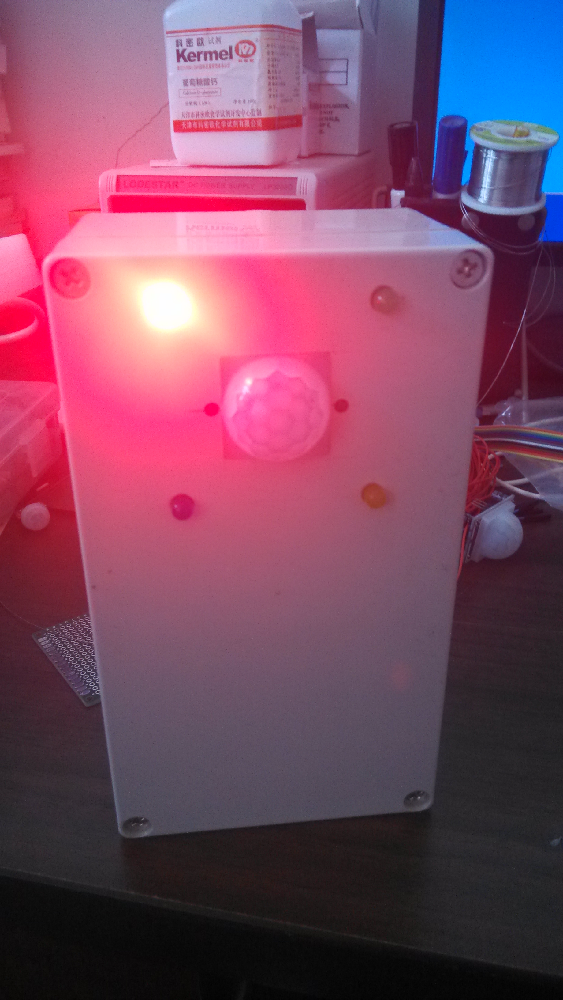
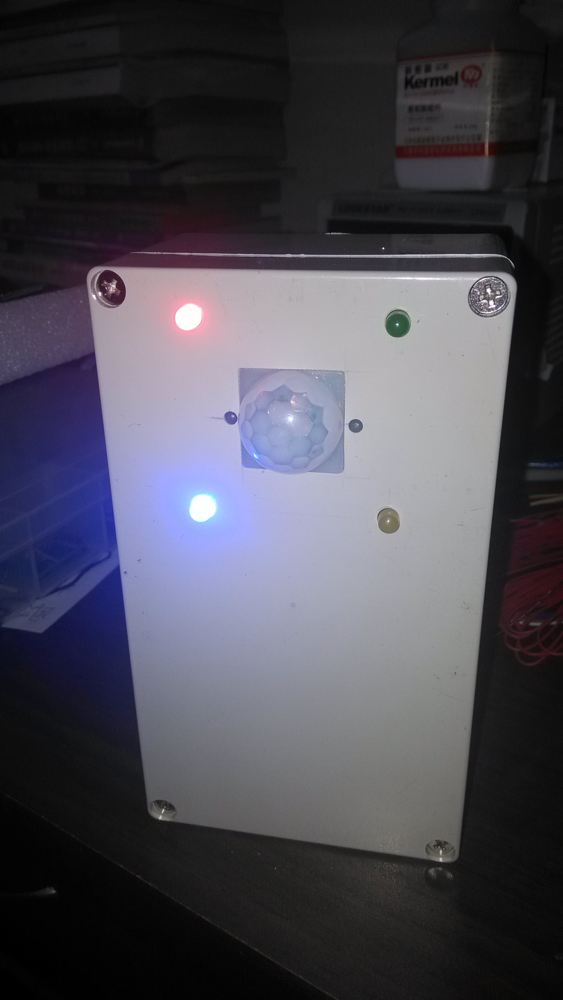
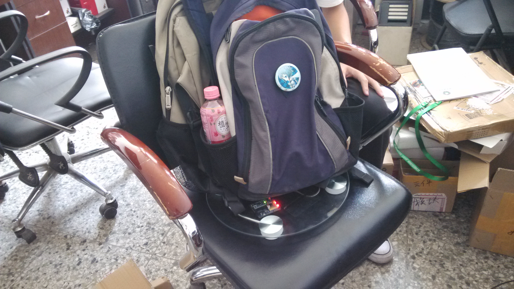
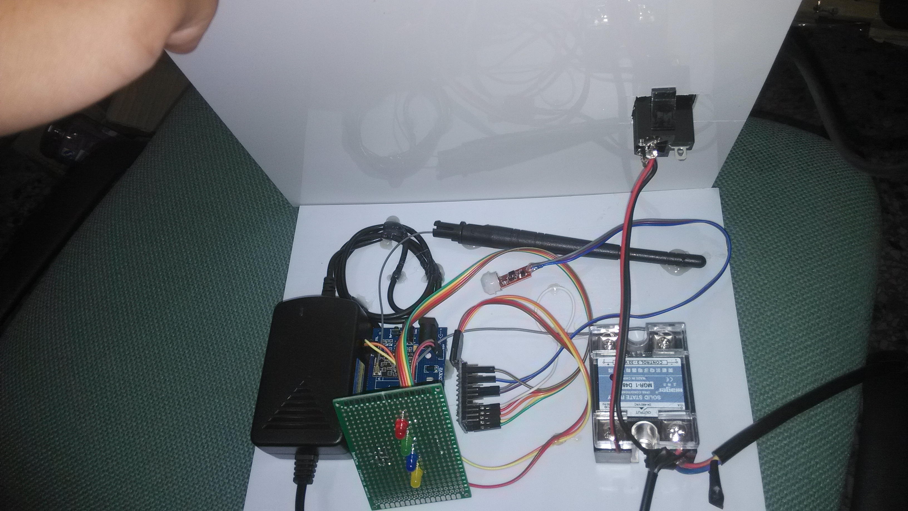

#智能办公
##单片机

###[红外检测](https://github.com/ypwhs/arduino/blob/master/HongWaiJianCe/HongWaiJianCe.ino)
###[坐垫检测](https://github.com/ypwhs/arduino/blob/master/HX711/HX711.ino)

##图

###盒子开启了电源

###盒子开启了固态继电器

###智能坐垫无人状态下

###总控内部结构

